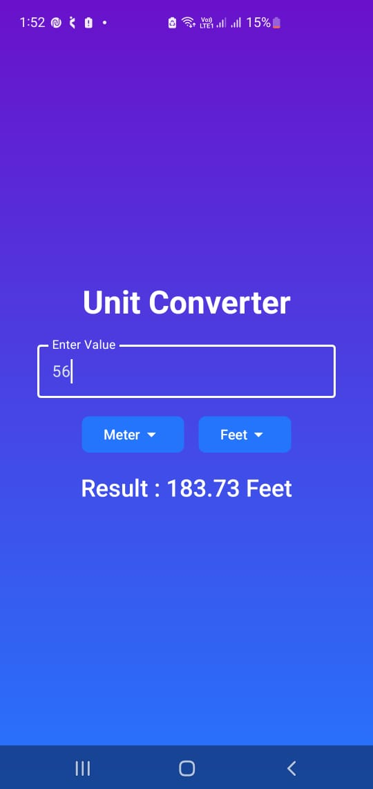

# 📏 Unit Converter App — Minimalist Conversion Tool (Android)

> _“Convert instantly. Designed with Jetpack Compose, built for real-world use.”_

**Unit Converter App** is a modern Android utility application that enables users to perform seamless unit conversions with an elegant and responsive interface powered by **Jetpack Compose**. The app leverages stateful composables, declarative UI principles, and clean design patterns to deliver a snappy user experience.

---

## 🚀 Features

- 🔁 **Live Unit Conversion**  
  Input any value and see the result update instantly across compatible units.

- 🎨 **Jetpack Compose UI**  
  Built using Material Design 3 and Kotlin for a responsive, declarative interface.

- 📦 **Dropdown Menus for Unit Selection**  
  Clean and intuitive component-based selection interface.

- 🔄 **Reactive State Handling**  
  Uses `remember`, `mutableStateOf`, and `by` keyword for real-time recomposition.

- 🔔 **User Feedback**  
  Includes Toast messages and error-safe input validation.

- 📱 **Optimized Layouts**  
  Adapts smoothly across different screen sizes and resolutions.

---

## 🧱 Tech Stack

| **Category**      | **Technology**                             |
|-------------------|--------------------------------------------|
| Language          | Kotlin                                     |
| UI Toolkit        | Jetpack Compose, Material 3                |
| Architecture      | Stateless & Stateful Composables           |
| State Management  | `remember`, `mutableStateOf`, `by` keyword |
| Components Used   | `OutlinedTextField`, `Button`, `DropdownMenu` |
| Layout System     | Column, Box, Modifier, Alignments          |

---
## 📸 Screenshots

| 

> _All screenshots are located in the `/Screenshots` folder.

---

## 🛠️ Setup Instructions

1. Clone the repository  
   ```bash
   git clone https://github.com/your-username/UnitConverterApp.git

2. Open in Android Studio (Flamingo/Giraffe or above)

3. Run the app on an emulator or physical device running Android 5.0+

---

🚧 Future Enhancements : 

🌍 Support for multiple unit categories (e.g., length, weight, volume)

🔠 Dynamic number formatting and precision settings

💾 Saved conversions using local storage

🌐 Multilingual support

👤 Author :

Aditya Chaturvedi

GitHub : https://github.com/Aditya-dev2005

LinkedIn : https://www.linkedin.com/in/aditya-chaturvedi-8b7776302/

---

💡 Project Purpose : 


This project is part of my Jetpack Compose journey, built to demonstrate:

Composable architecture

State management in Compose

Real-time user interaction with reactive UI
